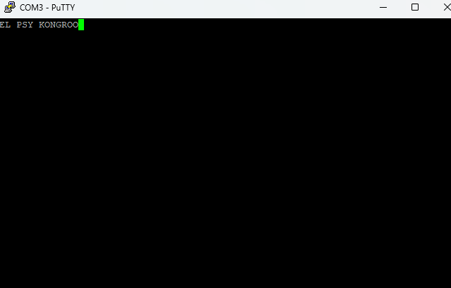

FG-RV32I (or as i like to call it: Future Gadget R Ver.3.2 I) is a 32 bit RISC-V processor written in VHDL which implements the RV32I instruction set and is completely pipelined. 

Currently, it counts with a whopping 4KB of instruction memory and 4KB of data memory, and can understand all of the RV32I instructions except for:

- FENCE instructions
- EBREAK
- ECALL
- PAUSE

However, the goal is to eventually implement these.

The structure of this repo is rather self-explanatory, however:
- src/ contains all of the VHDL rtl modules .
- tb/ contains the testbench files for the modules inside of src/, however not every single module has a corresponding testbench.
- test_programs/ contains a few programs that i used to test the processor:
  - fib.hex calculates the nth fibonacci sequence number, where n is stored in r4. I used this program to test branching.
  - add.hex adds 2 numbers using a "function call" (jal and jalr). I used this program to test jumping.
  - ram_init.hex performs all instructions, that are not jumps or branches, storing the result in the processor's registers.
- impl/ contains the files that are used to synthesized the core.vhd file (also contained within impl/). The synthesizable design core.vhd contains a memory mapped UART module which spans two(2) address: 0x0000 0400 to 0x0000 0401 where the first address belong to the control register and the second address belongs to the data register.

Currently, core.vhd is organized in such a way that the UART module only works as a transmitter.

Output of the test program send_h.hex, which used to transmit the characte 'h' but now transmits the iconic catchphrase "El Psy Kongroo"
